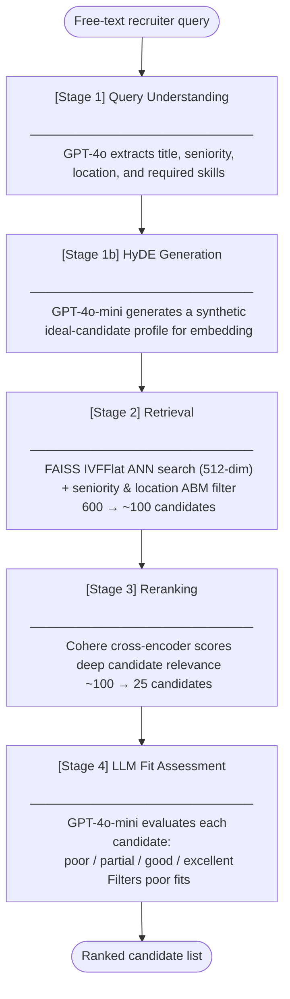

# HASS: Hiring Assistant Search System

HASS is an AI-powered candidate search system that converts natural language recruiter job descriptions into structured, ranked candidate matches using multi-stage semantic retrieval, reranking, and LLM-based evaluation.

In 2023 I built a recruiting assistant and hit these limits directly. HASS is the version that addresses them.

**Stack:** TypeScript · FAISS · OpenAI `text-embedding-3-large` · GPT-4o / 4o-mini · Cohere `rerank-v4.0-pro` · OpenAI Batch API

## Table of Contents

- [The Problem](#the-problem)
- [Key Technical Decisions](#key-technical-decisions)
- [Results & Deep Dive](#results--deep-dive)
  - [Matryoshka Experiment](#matryoshka-experiment-diminishing-returns-on-embedding-dimensions)
- [Architecture](#architecture)
- [Evaluation Methodology](#evaluation-methodology)
- [Example Sourcing Walkthrough](#example-sourcing-walkthrough)
- [Future Roadmap](#future-roadmap)
- [Quickstart](#quickstart)
- [Project Structure](#project-structure)

---

## The Problem

Recruiters rarely search using a handful of isolated keywords. Instead, they describe their ideal candidate in natural language:

> "Director of Engineering with 8+ years, distributed systems background, New York only."

Traditional search engines struggle with this—keyword search misses semantically equivalent profiles, faceted filters are brittle to construct from free-text, and nuanced qualification fit rarely maps cleanly to structured database fields.

---

## Key Technical Decisions

| Decision | Why |
|-----------|-----|
| **HyDE Retrieval** | Resolves embedding asymmetry; transforms short queries into profile-shaped documents to maximize recall before reranking. |
| **FAISS IVFFlat** | Enables fast, inverted-file approximate nearest-neighbor search to keep first-stage retrieval highly scalable. |
| **Cohere Reranker** | Utilizes a powerful cross-encoder to compute deep, interactive qualification alignment far better than raw cosine similarity. |
| **Ground Truth via Batch API** | Maximizes cost and time efficiency to generate a dense evaluation dataset for quantitative performance benchmarking. |
| **Synthetic Dataset** | Allowed full control over skill, seniority, and location distributions to reliably stress-test edge cases. |
| **512-dim at L1 / 3072-dim at L2** | ANN search time and index memory scale with embedding dimension. 512-dim keeps first-stage retrieval fast across large corpora; the full dimension is only applied at L2 where you're scoring a small top-N, not the entire index. |

---

## Results & Deep Dive

| Configuration      |   NDCG@10 |      R@50 |
| ------------------ | --------: | --------: |
| Baseline Retrieval |     0.581 |     0.287 |
| **+ HyDE Retrieval**   | **0.715** | **0.442** |

### Key Finding: Fix Retrieval Before Optimizing Precision

The largest performance leap did not come from a heavier reranking model; it came from fixing early-stage retrieval.

The baseline system embedded short recruiter queries directly (e.g., *"Senior ML engineer, expertise in Python, NLP"*). Because candidate profiles are long, comprehensive documents, their vectors lived in a different region of the embedding space. Many highly qualified candidates were missed entirely in Stage 1.

By introducing **HyDE**, GPT-4o-mini generates a synthetic "ideal profile" from the query first. Embedding this profile-shaped text aligns perfectly with the FAISS index structure. 

**Result:** R@50 shot up from **0.287 → 0.442 (+54%)** purely by optimizing query-side geometry without altering the underlying index.

### Matryoshka Experiment: Diminishing Returns on Embedding Dimensions

`text-embedding-3-large` supports Matryoshka Representation Learning (MRL) — lower-dimensional prefixes of the 3072-dim vector remain valid embeddings. The motivation: ANN search time and index memory scale with dimension, so using 512-dim at L1 keeps retrieval fast, while reserving the full 3072-dim for L2 where you're scoring a small top-N.

**Hypothesis:** The extra dimensions encode finer-grained qualification signals that would improve ranking precision at L2.

**Result:** +0.5pp NDCG@10 across multiple runs — effectively noise.

**Why:** For a general-purpose model without domain-specific fine-tuning, most semantic signal is already captured in the first 512 dimensions. A task-specific MRL model trained on (query, profile, relevance) triplets would front-load coarse signals in lower dimensions and reserve higher dimensions for nuanced qualification reasoning — that's when the larger budget matters. Without that training, the extra dimensions add latency without meaningful signal.

---

## Architecture



---

## Evaluation Methodology

### The Corpus & Ground Truth

To move away from anecdotal validation, I built a controlled testing ecosystem:

* **724 synthetic candidate profiles** distributed across 10 job functions and 9 seniority levels.
* **20 complex recruiter search queries**.
* To establish ground truth, the **OpenAI Batch API** evaluated every single query against every single profile (20 × 724 = 14,480 deterministic qualification judgments), classifying pairings strictly as `QUALIFIED` or `NOT_QUALIFIED`.

### Metrics Tracked

* **R@50 (Recall @ 50):** Measures the percentage of total qualified candidates captured in the top 50 results. This represents our pipeline's ceiling; if a candidate is missed here, a downstream reranker cannot save them.
* **NDCG@10 (Normalized Discounted Cumulative Gain):** Evaluates ranking quality, ensuring the absolute best matches are heavily penalized if they do not appear at the very top of the recruiter's feed.

---

## Example Sourcing Walkthrough

```bash
npm run search "Senior ML engineer, Python, NLP background, Bay Area"

```

```text
Loading index...
Running pipeline...

[Stage 1] Query understanding...
[Stage 1] Done: {
  "title": "ML engineer",
  "seniority": "senior",
  "location": { "region": "San Francisco Bay Area", "country": "United States" },
  "requiredQualifications": ["Python", "NLP background"],
  "queryText": "senior ML engineer, with expertise in Python, NLP background, based in San Francisco Bay Area"
}

================================================================================

#1  Priya Nair — Senior Machine Learning Engineer
     senior | Oakland, United States | 7 yrs exp
     Skills: Python, NLP, PyTorch, Transformers, spaCy, Hugging Face
     L1 score: 0.8007  |  L2 score: 0.9817  |  fit assessment: excellent

     The candidate is a Senior Machine Learning Engineer located in Oakland,
     which is within the San Francisco Bay Area. They have all required
     qualifications: Python and NLP.
--------------------------------------------------------------------------------

#2  Aisha Kamara — Senior ML Engineer
     senior | Berkeley, United States | 6 yrs exp
     Skills: Python, NLP, Deep Learning, PyTorch, BERT, LLMs
     L1 score: 0.7562  |  L2 score: 0.9734  |  fit assessment: excellent

     The candidate holds a Senior title, is located in Berkeley (which is
     within the San Francisco Bay Area), and meets all required qualifications
     with explicit skills in Python and NLP.
```

---

## Future Roadmap

| Current Implementation | Target Scalability |
| --- | --- |
| General-purpose embeddings | Fine-tuned dual-tower retrieval model |
| Generic cross-encoder | Recruiter behavioral-specific ranking model |
| HyDE generation latency cost | Learned query encoder / distillation |
| Synthetic profiles | Anonymized production-grade profiles |

---

## Quickstart

The profiles, FAISS index snapshots, and evaluation labels are pre-compiled and committed to the repository. Only API keys are required to run an instant demo.

### 1. Installation

```bash
npm install
cp .env.example .env

```

Configure your environment variables:

```bash
OPENAI_API_KEY=your_key_here
COHERE_API_KEY=your_key_here

```

### 2. Run an Active Search Pipeline

```bash
npm run search "Senior ML engineer, Python, NLP background, Bay Area"

```

### 3. Run the Evaluation Harness

```bash
# Full evaluation
npm run evaluate

# Rapid smoke test
npm run evaluate -- --limit=5

```

---

## Project Structure

```text
src/
  pipeline/         # the 4 pipeline stages + orchestrator
  embeddings/       # OpenAI embedding client + disk cache
  index/            # FAISS IVFFlat index build/load/search
  data/             # synthetic profile generator
  config.ts         # all tuning parameters and model choices
  types.ts          # TypeScript interfaces
scripts/
  generate.ts       # one-time: generate 724 synthetic profiles
  index.ts          # one-time: build embeddings + FAISS index
  search.ts         # interactive search demo
  evaluate.ts       # full eval harness (Matryoshka comparison)
  evalGenerate.ts   # generate ground-truth labels via Batch API
data/
  profiles.json             # 724 synthetic profiles (committed)
  embeddings_cache.json     # OpenAI embedding vectors for all profiles — 3072-dim floats per profile,
                            # cached to disk so re-runs don't re-call the API (67MB, not committed)
  index.faiss               # serialized FAISS IVFFlat index built from the 512-dim slice of each
                            # embedding — what gets searched at query time (committed)
  profile_id_map.json       # maps FAISS index positions → profile IDs (committed)
  eval_queries_raw.json     # the 20 hardcoded recruiter query strings (committed)
  eval_queries.json         # ground-truth relevance labels: for each query, which profile IDs are
                            # qualified — generated by asking an LLM to judge all 724 profiles
                            # against each query via OpenAI Batch API (committed)
  eval_results.json         # output from the last evaluate run — per-query NDCG@10, R@10, R@50
```
