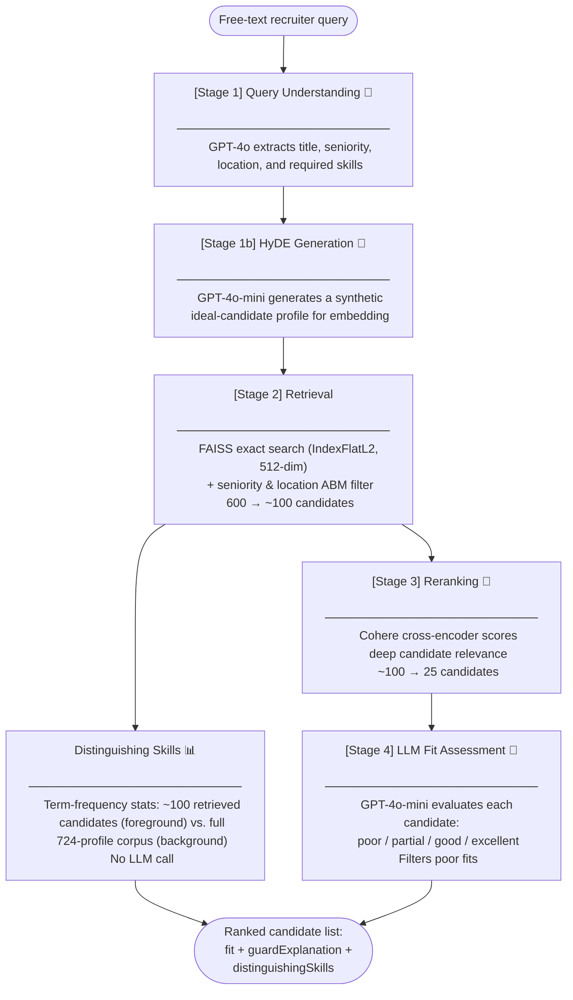
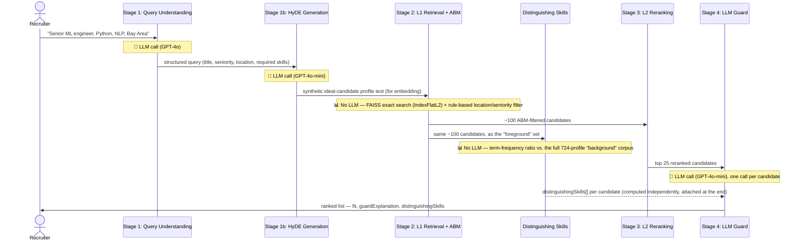

# Hiring Assistant Search System

> **Proof of concept, not a production system.** This is a self-directed research project built to study and replicate the architecture behind LinkedIn's public Hiring Assistant engineering blog posts, at small scale (724 synthetic profiles) using off-the-shelf models. It's a scoped exercise in retrieval-system tradeoffs, not something meant to be deployed as-is.

Hiring Assistant Search System (HASS) turns a recruiter's plain-English job description — *"Director of Engineering with 8+ years, distributed systems background, New York only"* — into a ranked list of candidates. It uses the same architecture shape as production semantic search systems: understand the query, retrieve candidates by meaning rather than keyword match, rerank the shortlist, then have an LLM sanity-check each fit.

**What this project demonstrates:**
- Every major design decision below is backed by a measured before/after
- Offline evaluation against a held-out ground-truth set, tracking recall and ranking metrics, reproducible results
- Diagnosing and fixing real LLM-pipeline failure modes — non-determinism, stages silently disagreeing with each other, confidently invented assumptions — with code and process changes
- Documents what's actually solved vs. what's a known, documented limitation (see [Acronym Handling](#acronym-handling-a-documented-limitation-not-a-fix))

**Stack:** TypeScript · FAISS · OpenAI `text-embedding-3-large` · GPT-4o / 4o-mini · Cohere `rerank-v4.0-pro` · OpenAI Batch API

## See It In Action

```bash
npm run search "Senior ML engineer, Python, NLP background, Bay Area"
```

```text
[Stage 1] Query understanding...
[Stage 1] Done: {
  "raw": "Senior ML engineer, Python, NLP background, Bay Area",
  "title": "ML engineer",
  "seniority": "senior",
  "location": {
    "city": null,
    "region": "San Francisco Bay Area",
    "country": "United States"
  },
  "locationStrict": true,
  "qualifications": ["Python", "NLP background"],
  "requiredQualifications": ["Python", "NLP background"],
  "ambiguousQualifications": [],
  "queryText": "senior ML engineer, with expertise in Python, NLP background, based in San Francisco Bay Area"
}
[Stage 2] L1 retrieval + ABM...
[Stage 2] Done: 100 candidates after ABM filter
[Stage 3] L2 reranking (mode: cohere)...
[Stage 3] Done: 25 candidates after rerank
[Stage 4] LLM guard...
[Stage 4] Done: 10 candidates after guard filter (2 poor fits removed)
Found 10 candidates in 9.4s

================================================================================

#1  Priya Nair — Senior Machine Learning Engineer
     senior | Oakland, United States | 7 yrs exp
     Skills: Python, NLP, PyTorch, Transformers, spaCy, Hugging Face, MLflow, SQL, Docker, AWS
     Distinguishing: Hugging Face (7.2x), MLflow (7.2x), spaCy (7.2x)
     L1 score: 0.8013  |  L2 score: 0.9817  |  fit assessment: excellent

     The candidate meets all requirements: they have the required skills in Python and NLP, and their seniority and location are both a match.
--------------------------------------------------------------------------------

#2  Aisha Kamara — Senior ML Engineer
     senior | Berkeley, United States | 6 yrs exp
     Skills: Python, NLP, Deep Learning, PyTorch, BERT, LLMs, RAG, Vector Databases, FastAPI, GCP
     Distinguishing: RAG (7.2x), Vector Databases (7.2x), GCP (3.6x)
     L1 score: 0.7590  |  L2 score: 0.9734  |  fit assessment: excellent

     The candidate meets all requirements: they have the required skills in Python and NLP, and their seniority and location are both a match.
--------------------------------------------------------------------------------

... (7 more candidates, ranging excellent → good → partial as seniority/skill gaps grow) ...

--------------------------------------------------------------------------------

Total pipeline latency: 9.40s
```

`Distinguishing` is a free signal computed alongside the ranking — no LLM call, no extra cost (see [Distinguishing Skills](#distinguishing-skills-statistical-explainability-no-llm)).

### It also survives typos, glommed phrases, and vague abbreviations

```bash
npm run search "Find me an AI RAG LLM enginner who kows psytorch, TS, and sematic serch"
```

```json
{
  "title": "AI RAG LLM engineer",
  "qualifications": ["RAG", "LLM", "PyTorch", "TS", "semantic search"],
  "requiredQualifications": ["RAG", "LLM", "PyTorch", "TS", "semantic search"],
  "ambiguousQualifications": ["TS"],
  "queryText": "AI RAG LLM engineer, with expertise in RAG, LLM, PyTorch, TS, semantic search"
}
```

`"psytorch"` and `"sematic serch"` get corrected to `"PyTorch"`/`"semantic search"`; `"AI RAG LLM"` gets split into separate skills instead of one glommed string; `"TS"` is left alone and explicitly flagged ambiguous rather than silently guessed as TypeScript — see [Acronym Handling](#acronym-handling-a-documented-limitation-not-a-fix) for why that distinction matters.

### Works across job categories

| Query | Job category | Distinguishing skills surfaced |
| --- | --- | --- |
| *"Senior ML engineer, Python, NLP background, Bay Area"* | Tech / IC | Hugging Face, RAG, Feature Stores, MLflow — niche tooling, never the shared basics |
| *"Director of Engineering with 8+ years, distributed systems background"* | Tech / management | Bioinformatics, Compliance (SOC2, HIPAA), Channel Partner Management |
| *"Senior marketing manager with SEO and content strategy experience"* | Non-tech | marketing automation, Brand Voice, Attribution Modeling |

---

## What This PoC Tries to Prove

Two claims are empirically tested here, not asserted:

1. **HyDE-based retrieval fixes a real, measured embedding-asymmetry recall gap** — R@50 went from 0.287 → 0.442 (see [Results & Deep Dive](#results--deep-dive)).
2. **Reducing embedding dimensionality for first-stage retrieval costs nothing in ranking quality on a generic embedding model** — +0.5pp NDCG (noise-level), which is consistent with LinkedIn's own rationale for why their fine-tuned MUSE model needs task-specific training to make higher dimensions worth the latency (see [Matryoshka Experiment](#matryoshka-experiment-diminishing-returns-on-embedding-dimensions)).

One scale-driven decision worth flagging up front: this uses **exact (not approximate) nearest-neighbor search**, deliberately, because 724 profiles is far below the scale where ANN's recall/speed tradeoff would actually matter — see the FAISS decision below.

## Table of Contents

- [See It In Action](#see-it-in-action)
- [What This PoC Tries to Prove](#what-this-poc-tries-to-prove)
- [The Problem](#the-problem)
- [Key Technical Decisions](#key-technical-decisions)
- [Query Understanding Techniques Implemented](#query-understanding-techniques-implemented)
- [Results & Deep Dive](#results--deep-dive)
  - [Matryoshka Experiment](#matryoshka-experiment-diminishing-returns-on-embedding-dimensions)
- [Architecture](#architecture)
- [Distinguishing Skills: Statistical Explainability (No LLM)](#distinguishing-skills-statistical-explainability-no-llm)
- [Acronym Handling: A Documented Limitation, Not a Fix](#acronym-handling-a-documented-limitation-not-a-fix)
- [Evaluation Methodology](#evaluation-methodology)
- [Future Roadmap](#future-roadmap)
- [Quickstart](#quickstart)
- [Project Structure](#project-structure)
- [References](#references)

---

## The Problem

Recruiters rarely search using a handful of isolated keywords. Instead, they describe their ideal candidate in natural language:

> "Director of Engineering with 8+ years, distributed systems background, New York only."

Traditional search engines struggle with this—keyword search misses semantically equivalent profiles, faceted filters are brittle to construct from free-text, and nuanced qualification fit rarely maps cleanly to structured database fields.

---

## Key Technical Decisions

| Decision | Why |
|-----------|-----|
| **HyDE Retrieval** (*have the LLM write a fake "ideal candidate" first, then search with that instead of the raw query*) | Resolves embedding asymmetry — the mismatch between how a short query and a long profile land in vector space; transforms short queries into profile-shaped documents to maximize recall before reranking. |
| **FAISS Exact Search (`IndexFlatL2`)** | Deliberately not ANN (*approximate nearest-neighbor search — trades a little accuracy for a lot of speed at huge scale*). At 724 profiles, brute-force cosine search is sub-millisecond with zero recall loss. Approximate indexing (IVF/IVFPQ) only pays off once brute-force becomes too slow — millions of vectors, not hundreds — so it's the wrong tool to reach for at this scale. |
| **Cohere Reranker** | Utilizes a cross-encoder (*a slower, more accurate model that reads the query and candidate together, rather than comparing pre-computed vectors*) to compute deep, interactive qualification alignment far better than raw cosine similarity. |
| **Ground Truth via Batch API** | Maximizes cost and time efficiency to generate a dense evaluation dataset for quantitative performance benchmarking. |
| **Synthetic Dataset** | Allowed full control over skill, seniority, and location distributions to reliably stress-test edge cases. |
| **512-dim at L1 / 3072-dim at L2** | Search time and index memory scale with embedding dimension regardless of exact-vs-approximate search. 512-dim keeps first-stage retrieval fast across large corpora; the full dimension is only applied at L2 where you're scoring a small top-N, not the entire index. |
| **Term-Frequency Explainability (no LLM)** | A second "why this candidate" signal — which of a candidate's skills are statistically overrepresented in the retrieved pool vs. the full corpus — computed with plain term-frequency math, not a model call. Zero marginal cost, zero hallucination risk, sits alongside the LLM guard's explanation rather than replacing it. See [Distinguishing Skills](#distinguishing-skills-statistical-explainability-no-llm). |
| **Deterministic, Shared Acronym Resolution** | A small static table (not an LLM judgment call) resolves unambiguous abbreviations (`K8s`→Kubernetes) and explicitly flags genuinely ambiguous ones (`TS`) as unresolved — used identically by Stage 1 and Stage 4 so the two can never silently disagree about what an abbreviation means. Does not resolve genuine ambiguity, only makes not-knowing consistent and visible. See [Acronym Handling](#acronym-handling-a-documented-limitation-not-a-fix). |

---

## Query Understanding Techniques Implemented

| Technique | Implemented? | Where |
|---|---|---|
| Semantic query parsing | ✅ | Stage 1 — query understanding (`queryUnderstanding.ts`) |
| Phrase extraction | ✅ | Stage 1 — compound-phrase splitting, filler-word stripping |
| Misspelling correction | ✅ | Stage 1 — typo correction (separate from abbreviation handling) |
| Query rewriting | ✅ | Stage 1b — HyDE synthetic profile generation before embedding |
| Synonym expansion | ❌ Not implemented | Only narrow, hardcoded acronym resolution exists (`src/acronyms.ts`) — not general synonyms |

---

## Results & Deep Dive

| Configuration      |   NDCG@10 |      R@50 |
| ------------------ | --------: | --------: |
| Baseline Retrieval |     0.581 |     0.287 |
| **+ HyDE Retrieval**   | **0.715** | **0.442** |

### Key Finding: Fix Retrieval Before Optimizing Precision

The largest performance leap did not come from a heavier reranking model; it came from fixing early-stage retrieval.

The baseline system embedded short recruiter queries directly (e.g., *"Senior ML engineer, expertise in Python, NLP"*). Because candidate profiles are long, comprehensive documents, their vectors lived in a different region of the embedding space. Many highly qualified candidates were missed entirely in Stage 1.

By introducing **HyDE**, GPT-4o-mini generates a synthetic "ideal profile" from the query first. Embedding this profile-shaped text aligns perfectly with the FAISS index structure. 

**Result:** R@50 shot up from **0.287 → 0.442 (+54%)** purely by optimizing query-side geometry without altering the underlying index.

### Matryoshka Experiment: Diminishing Returns on Embedding Dimensions

`text-embedding-3-large` supports Matryoshka Representation Learning (MRL) — trained so that just the first N numbers of its full vector are still a valid, usable embedding on their own, like nesting dolls. That means a shorter, cheaper 512-number slice of the same embedding can be used for fast first-pass search, while reserving the full 3072-number version for the final, small-scale reranking pass where quality matters more than speed.

**Hypothesis:** The extra dimensions encode finer-grained qualification signals that would improve ranking precision at L2.

**Result:** +0.5pp NDCG@10 across multiple runs — effectively noise.

**Why:** For a general-purpose model without domain-specific fine-tuning, most semantic signal is already captured in the first 512 dimensions. A task-specific MRL model trained on (query, profile, relevance) triplets would front-load coarse signals in lower dimensions and reserve higher dimensions for nuanced qualification reasoning — that's when the larger budget matters. Without that training, the extra dimensions add latency without meaningful signal.

---

## Architecture



🤖 = LLM call · 📊 = pure computation, no model call. Notice `Distinguishing Skills` branches off the *same* Stage 2 output that feeds Stage 3 — it runs independently, in parallel, and never touches an LLM; it only rejoins the pipeline at the very end, attached to whichever candidates survive Stage 3/4. See [below](#distinguishing-skills-statistical-explainability-no-llm) for why, and the sequence diagram for exactly how data threads through.

---

## Distinguishing Skills: Statistical Explainability (No LLM)

Stage 4's LLM guard already explains *why a candidate matches the query* (title/seniority/location/required skills). This second signal answers a different question — *what makes this candidate statistically typical of the pool that got retrieved* — using no model call at all. It's inspired by Solr's Semantic Knowledge Graph (`relatedness()`): compare how common a term is in a "foreground" set vs. a "background" set; a term that's disproportionately common in the foreground is distinguishing.

Applied here:
- **Foreground** = the ~100 candidates Stage 2 already retrieved for this query.
- **Background** = the full 724-profile corpus.
- **Enrichment** per skill = `(fraction of foreground with the skill) / (fraction of background with the skill)`. Since the foreground is always a subset of the background, this ratio is always defined — no smoothing needed.
- Per surviving candidate, keep only *their own* skills that score > 1 (enriched), sorted descending, top 3. Ties (common for skills that appear only once in the whole corpus) break by how many of the retrieved pool shares the skill, then alphabetically — so output is always deterministic, never arbitrary insertion order.

The sequence diagram below makes explicit which stages call an LLM and which don't, and exactly where this signal branches off and rejoins:



The key thing this diagram is meant to clarify: `Distinguishing Skills` is **not** a step in the LLM chain (Stage 1 → 1b → 4). It's a side branch off Stage 2's output, computed once per query in plain JavaScript, and merged back in only when the final result list is assembled — it can never fail, retry, hallucinate, or cost an API call, because it never talks to a model.

### Validated Across Job Categories

See the [job-category table](#see-it-in-action) at the top of this README — ran three live queries spanning very different skill vocabularies to confirm the signal isn't secretly tech-biased or fragile outside the ML-engineer happy path. Across all three: no crashes, no `NaN`/undefined values, sensible multipliers throughout (no arbitrary-looking ties — the tiebreak logic held up on real, varied data, not just hand-built test fixtures).

---

## Acronym Handling: A Documented Limitation, Not a Fix

Recruiter queries are full of abbreviations, and some are genuinely ambiguous — a query like *"knows TS"* could mean TypeScript or Time Series, and there's no way to know which without more context. Testing live surfaced two real failure modes from this:

1. **Stage 1 leaving an abbreviation unresolved is fine — Stage 4 silently guessing one is not.** In one run, Stage 1 correctly left `"TS"` as written, but Stage 4's guard, in a separate LLM call with no visibility into Stage 1's caution, confidently decided on its own that `"TS"` meant TypeScript and penalized every candidate for lacking it — an interpretation nobody asked for, invisible to whoever reads the result.
2. **A single LLM call isn't reliably consistent even with itself.** Before this fix, the guard could write an explanation naming 2+ missing qualifications while still labeling the candidate `good` — the label and the reasoning behind it simply disagreed.

**What's implemented (`src/acronyms.ts`):** a small, deterministic, shared lookup — not an LLM judgment call — used identically by Stage 1 and Stage 4:
- Genuinely unambiguous abbreviations (`K8s`→Kubernetes) are expanded in code, once, so both stages see the same resolved term.
- Abbreviations already standard-as-written (`NLP`, `RAG`, `LLM`, ...) are left alone — expanding these would break matches against profiles that use the same short form.
- Anything else abbreviation-shaped and unrecognized (`TS`) is flagged `ambiguous` and passed through to Stage 4 with an explicit instruction: verify the literal string only, never substitute a guessed technology, and phrase the explanation around the unresolved abbreviation rather than a confident but invented interpretation.

Separately, Stage 4 now must output a per-qualification checklist (`qualificationChecks`) rather than a single self-reported "missing count" — code computes the count and enforces the `fit` label's consistency with it, rather than trusting the model to self-apply its own stated rules.

**Determinism:** testing this also surfaced a third issue — the same query could classify a qualification as "required" on one run and not on the next, purely from GPT-4o's own sampling randomness, unrelated to any of the above. Both classification calls (Stage 1 query understanding, Stage 4 guard) now run with `temperature: 0` and a fixed `seed`, config-driven via `CONFIG.openai.chat.classificationTemperature`/`classificationSeed`. HyDE generation (Stage 1b) is deliberately left untouched — it's generative-by-design, not a classification call, so determinism isn't the goal there. Note this is best-effort reproducibility, not a hard guarantee.

See the ["it also survives typos" example](#see-it-in-action) at the top of this README for typo correction, compound splitting, filler stripping, and ambiguity flagging all exercised by one query. Re-ran that exact query 3 times back-to-back after adding `temperature: 0` + a fixed `seed` — identical output every time, character for character, confirming the determinism fix actually holds in practice, not just in theory.

**What this does not do: actually resolve ambiguity.** `"TS"` is still `"TS"` — we've made not-knowing consistent and honest across both stages, not resolved. Two paths forward if that's not enough:

- **Interactive clarification** — surface flagged-ambiguous terms back to the recruiter before running the rest of the pipeline (*"did you mean TypeScript or Time Series?"*), matching the real Hiring Assistant's "interactive UX" philosophy of resolving ambiguity with the human before large-scale execution. Requires an actual clarification loop — `scripts/search.ts` is currently one-shot, and `evaluate.ts` runs unattended with no human in the loop.
- **A skill ontology/knowledge graph** — instead of a static two-way table (known-safe vs. known-expansion vs. ambiguous), a structured ontology could use surrounding query context (title, other required qualifications) to disambiguate with actual confidence — e.g. inferring "TS" likely means TypeScript when co-occurring with "React", or Time Series when co-occurring with "forecasting". This is the next PoC direction if the deterministic-table approach proves too coarse in practice.

---

## Evaluation Methodology

### The Corpus & Ground Truth

To move away from anecdotal validation, I built a controlled testing ecosystem:

* **724 synthetic candidate profiles** distributed across 10 job functions and 9 seniority levels.
* **20 complex recruiter search queries**.
* To establish ground truth, the **OpenAI Batch API** evaluated every single query against every single profile (20 × 724 = 14,480 deterministic qualification judgments), classifying pairings strictly as `QUALIFIED` or `NOT_QUALIFIED`.

### Metrics Tracked

* **R@50 (Recall @ 50):** Measures the percentage of total qualified candidates captured in the top 50 results. This represents our pipeline's ceiling; if a candidate is missed here, a downstream reranker cannot save them.
* **NDCG@10 (Normalized Discounted Cumulative Gain):** Evaluates ranking quality, ensuring the absolute best matches are heavily penalized if they do not appear at the very top of the recruiter's feed.

---

## Future Roadmap

| Current Implementation | Target Scalability |
| --- | --- |
| General-purpose embeddings | Fine-tuned dual-tower retrieval model |
| Generic cross-encoder | Recruiter behavioral-specific ranking model |
| HyDE generation latency cost | Learned query encoder / distillation |
| Synthetic profiles | Anonymized production-grade profiles |
| Static acronym table + ambiguity flagging | Skill ontology / knowledge graph for context-aware disambiguation, or interactive recruiter clarification (see [Acronym Handling](#acronym-handling-a-documented-limitation-not-a-fix)) |

---

## Quickstart

The profiles, FAISS index snapshots, and evaluation labels are pre-compiled and committed to the repository. Only API keys are required to run an instant demo.

### 1. Installation

```bash
npm install
cp .env.example .env

```

Configure your environment variables:

```bash
OPENAI_API_KEY=your_key_here
COHERE_API_KEY=your_key_here

```

### 2. Run an Active Search Pipeline

```bash
npm run search "Senior ML engineer, Python, NLP background, Bay Area"

```

### 3. Run the Evaluation Harness

```bash
# Full evaluation
npm run evaluate

# Rapid smoke test
npm run evaluate -- --limit=5

```

---

## Project Structure

```text
src/
  pipeline/         # the 4 pipeline stages + orchestrator + matchStats.ts (no-LLM explainability)
  embeddings/       # OpenAI embedding client + disk cache
  index/            # FAISS exact-search (IndexFlatL2) index build/load/search
  data/             # synthetic profile generator
  config.ts         # all tuning parameters and model choices
  types.ts          # TypeScript interfaces
  __tests__/        # unit tests, including matchStats.test.ts
scripts/
  generate.ts       # one-time: generate 724 synthetic profiles
  index.ts          # one-time: build embeddings + FAISS index
  search.ts         # interactive search demo
  evaluate.ts       # full eval harness (Matryoshka comparison)
  evalGenerate.ts   # generate ground-truth labels via Batch API
data/
  profiles.json             # 724 synthetic profiles (committed)
  embeddings_cache.json     # OpenAI embedding vectors for all profiles — 3072-dim floats per profile,
                            # cached to disk so re-runs don't re-call the API (67MB, not committed)
  index.faiss               # serialized FAISS exact-search (IndexFlatL2) index built from the 512-dim slice of each
                            # embedding — what gets searched at query time (committed)
  profile_id_map.json       # maps FAISS index positions → profile IDs (committed)
  eval_queries_raw.json     # the 20 hardcoded recruiter query strings (committed)
  eval_queries.json         # ground-truth relevance labels: for each query, which profile IDs are
                            # qualified — generated by asking an LLM to judge all 724 profiles
                            # against each query via OpenAI Batch API (committed)
  eval_results.json         # output from the last evaluate run — per-query NDCG@10, R@10, R@50
```

---

## References

LinkedIn engineering blog posts this project studies:

- [How We Engineered LinkedIn's Hiring Assistant](https://www.linkedin.com/blog/engineering/ai/how-we-engineered-linkedins-hiring-assistant)
- [Semantic Search for AI Agents at Scale: Retrieval and Ranking for LinkedIn's Hiring Assistant](https://www.linkedin.com/blog/engineering/ai/semantic-search-for-ai-agents-at-scale-retrieval-and-ranking-for-linkedins-hiring-assistant)
